# n8n-selftbot
Telegram userbot for analyzing user messages with LLM. Supports local PostgreSQL DB & automatic result messages sending to Telegram chat

## Setup and Build
Все дальнейшие действия, связанные с установкой файлов из данного репозитория производятся пользователем на свой страх и риск. За несоблюдение пользовательского соглашения и правил использования Telegram предусмотрены различные ограничительные меры. Ответственность за их нарушение, а также ответственность за передачу учётных данных аккаунта вы несёте самостоятельно. Все риски и их возможные последствия установки и передачи данных сторонним сервисам несёте только вы.

**Повторяйте нижеследующие щаги для последовательной установки и развёртывания проекта:**

**0. Клонируем репозиторий в желаемую директорию**
Создаём отдельную директорию для проекта. В директории будет склонирована папка `n8n-output` для взаимодействия с файлами через n8n. При желании название директории можно изменить, но важно изменить это название в .yml файле (упомянуто ниже).
Если нет опыта с Git, нажимаем `Download ZIP` и извлекаем содержимое архива в директорию проекта.

Или используйте предпочитаемый протокол:

`git clone https://github.com/sharkywasd/n8n-selfbot-message-parser.git` (HTTPS)

`git clone git@github.com:sharkywasd/n8n-selfbot-message-parser.git` (SSH, использовать, если настроен SSH-ключ)

**1. Регистрируем API Development Tools**

https://my.telegram.org/auth

1) Проходим авторизацию, вводим код. Попадаем на следующую страницу:

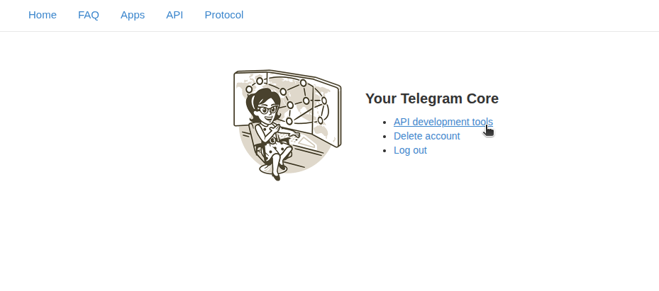

2) Нажимаем `API development tools`, попадаем в `Create new application`. Создаём новое приложение для получения API_ID и API_HASH
Заполняем все поля, вводим вразумительные названия, к примеру: 
- App Title: `Client Help Desk`
- App Shortname: `helpdesk1`
- URL: например, случайный сдаваемый в аренду (не занятый) домен, соответствующий региону регистрации аккаунта, я использовал `sviter.ru`
- Platform: Практичестки не имеет знаечния, я оставлял стандартный `Android`, можно попробовать `Web` или `Desktop`.
- Description: Имеющее смысл краткое описание на 10-15 слов. `Application for answering on client questions with of the automatic help desk`

3) Нажимаем `Create application`. На момент релиза рабочей версии (19.01.2026) Telegram до сих пор ведёт жестокий контроль за созданием данных приложений (получаем простое `ERROR` в ответ на нажатие кнопки), в  РФ осложнена регистрация новых аккаунтов. У меня получилось зарегистрировать приложение после насилия на кнопкой путём многократного нажатия кнопки и сброса ошибки с помощью клавиши `Enter` в течение 10 минут. Добро пожаловать в мир магии при регистрации приложения Telegram для получения api_id, api_hash, удачи!

**2. Билдим контейнер**
В .yml файле описаны службы и образы, которые будут созданы и развёрнуты, в их список входят:
- заглушка для телеметрии Telepilot, которая мешает работе ноды (потому что баг Telepilot)
- БД postgresql
- n8n с предустановленной community-нодой Telepilot (@telepilotco/n8n-nodes-telepilot). В образе промаплена дополнительная папка `- ./n8n-output:/home/node/.n8n-files` в директории проекта, для чтения/записи файлов через n8n. При переименовании папки заменяем `n8n-output` в данной строке на название папки в директории проекта, которое вы ей задали.

Необходим установленный Docker и плагин Docker Compose:
https://docs.docker.com/compose/install/

1) Настраиваем переменные в .env(`./src/env_expample.txt`): 
- Переименовываем файл: `.env`
- `API_ID` и `API_HASH`,
- `N8N_BASE_URL` оставляем по умолчанию, если не изменяли в .yml файле и если порт по умолчанию не занят.
-  `POSTGRES_USER` -  на ваше усмотрение (по умолчанию admin) и `POSTGRES_PASSWORD` для PostgreSQL
- Флаги `N8N_COMMUNITY_PACKAGES_ENABLED` и `N8N_COMMUNITY_PACKAGES_PREVENT_LOADING` оставляем `true` и `false` соответственно (в случае ошибок свериться со значениями данных флагов в документации n8n текущей версии: https://docs.n8n.io/hosting/configuration/environment-variables/nodes/)
- Параметры `N8N_LOG_LEVEL` и `N8N_LOG_OUTPUT` оставляем по умолчанию `info` и `console` (при необходимости изменяем: https://docs.n8n.io/hosting/logging-monitoring/logging/)

2) Перед запуском контейнера необходимо выполнить сборку с помощью Docker-файла (`Dockerfile`). Благодаря данному действию мы решаем проблему Telepilot № 1 (подробнее см. раздел `Особенности`) связанную с неверной установкой библиотек. Используя терминал и перейдя в директорию c докерфайлами (`./src/dockerfiles`), выполняем команду:

`docker compose build`

После успешного билда можно запускать контейнер:

`docker compose up -d`

Через 30-60 секунд переходим на http://localhost:5678

Проходим регистрацию на n8n, заполняем поля:

Создаём новый форклоу и проверяем работоспособность коммюнити-ноды Telepilot и успешность билда:

1) Создаём новый workflow и импортируем файл `Session Control.json` (`./scr/workflows/`):

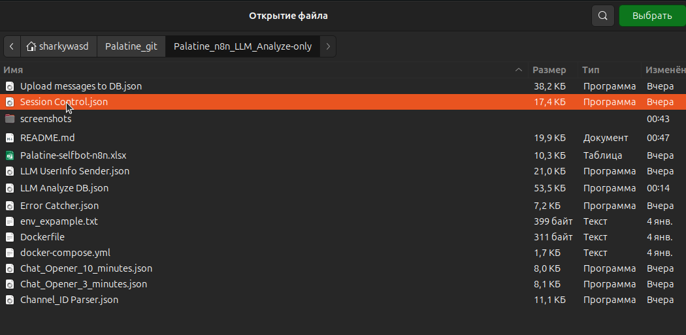

2) Заполняем credetials в ноде `Manual control` приссоединённой к ноде `When chat message receivede`
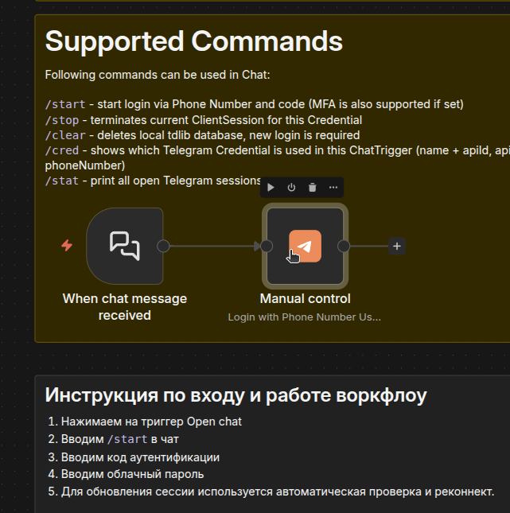

3) В workflow находим триггер `When chat message receivede`.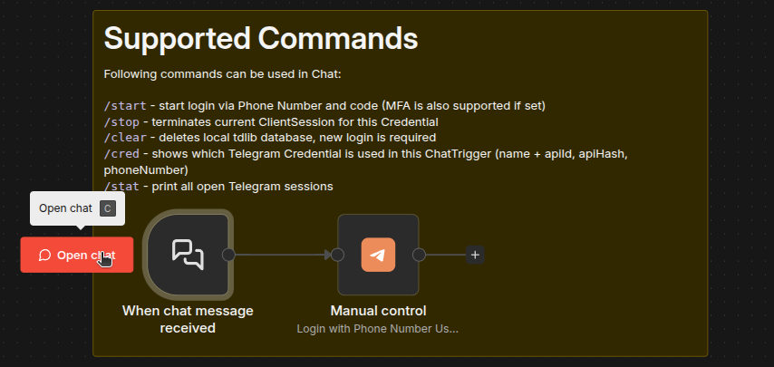

3) Пишем в чат-триггер ноду `/start`. При правильной работоспособности вы получите в течение 3-5 секунд сообщение от Telegram с кодом двухфакторной авторизации для входа в аккаунт (В данный момент вы передаёте данные для входа в свой аккаунт стороннему сервсиу, что может повлечь потерю аккаунта, выполнять только осознавая данный риск! по собственной воле, вся ответственность за ваш аккаунт и его безопасность лежит на вас!)

Если пришёл код, то значит билд установился правильно и решена проблема с установкой зависимостей Telepilot. Если ошибка сообщает об отсутствии prebuilt libraries - билдим по новой, следим за успешностью выполнения билда.

Вернёмся к импорту workflow позже, а сейчас настроим все сервисы, необходимые для работы проекта.

## Подготавливаем сервисы, ноды, секреты.

**1. Подключение сервисов Google Cloud Console**

1) Вход в аккаунт. Создание нового проекта
https://console.cloud.google.com/projectcreate
2) Перходим в меню APIs & services, в поиске находим `Google Drive API` и включаем. Далее находим `Google Sheets API`, включаем.
3) Переходим в меню OAuth consent screen, жмём "Get Started". Заполняем название и свой e-mail в App Infomation. В Audience выбираем External. Снова свою почту в Contact Infomation, читаем :\) и принимаем соглашение, создаём. Дальше создаём OAuth client. Выбираем Web Application, название. Добавляем ссылку для редиректа из ноды Google Sheets в n8n в Authorized redirect URIs. **СОХРАНЯЕМ** Client ID и Client Secret.
4) Заходим в меню Audience, вводим свой e-mail в тестовых юзеров, сохраняем.
5) Создаём новый workflow, импортируем файл `LLM Analyze DB.json`. 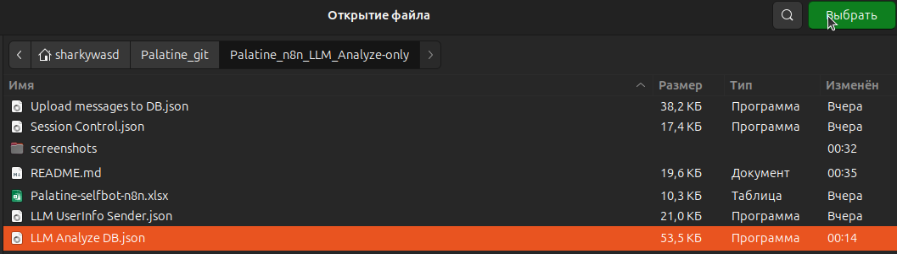 В ноде Google Sheets, например, в ноде "Успех" добавляем новые учётные данные с предыдущих шагов (Client ID, Client Secret), сохраняем. Если видим зеленый цвет и сообщение об успешном тесте данных, то нажимаем `Sign in with Google` и входим с помощью почты тестового юзера. После предупреждения о проверке придоэения на следующем экране проставляем все три галочки-разрешения для корректной работы ноды. Если всё было сделано правильно, то получите сообщение об успешном подключении сервиса.

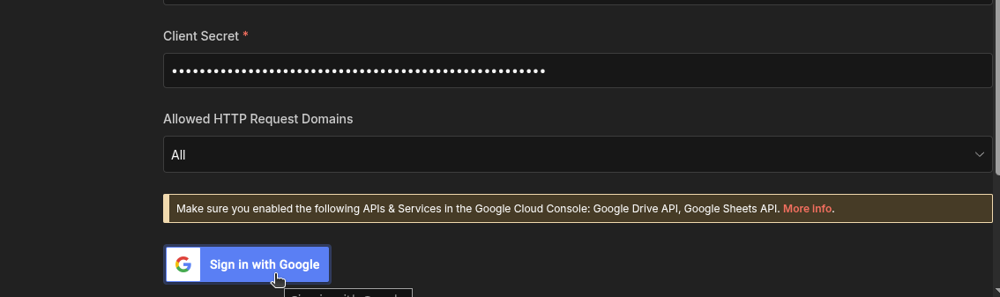

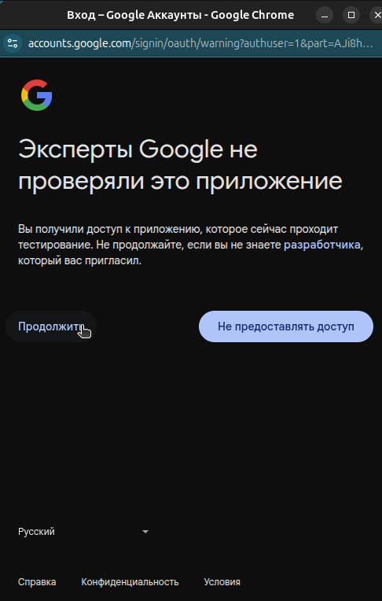

После данных шагов можно создать новую Гугл Таблицу и импортировать в неё предлагамую структуру листов и столбцов с помощью Excel файла `Palatine-selfbot-n8n.xlsx`.

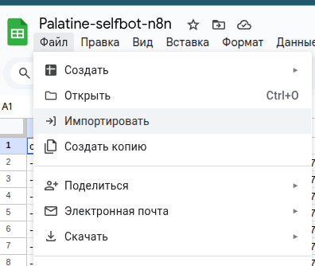
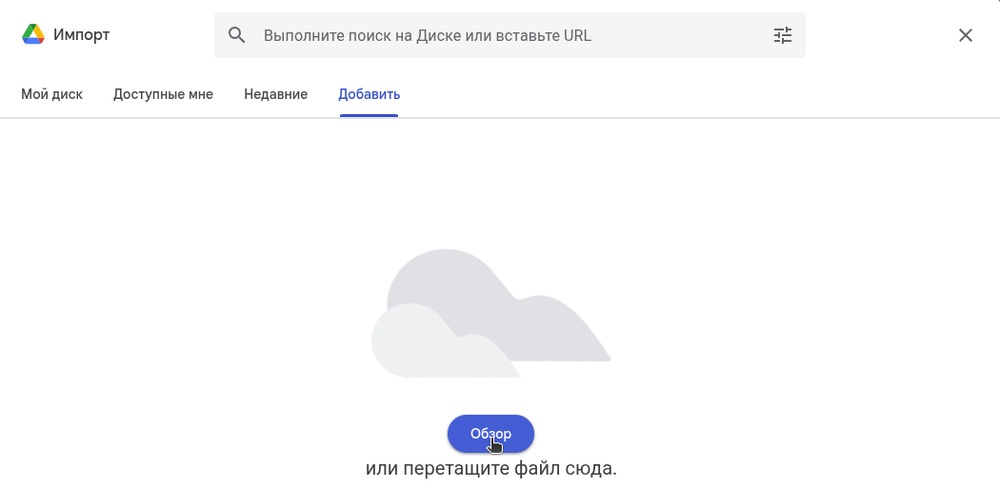
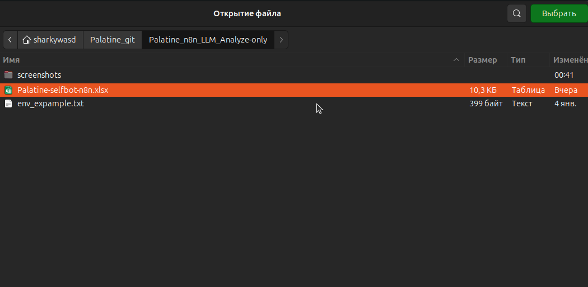

Предлагаемая структура:
1) PasteChannelLinks - лист для вставки ссылок каналов, ID которых необходимо получить с помощью работы workflow Channel_ID Parser/ Вставляем на лист ссылки, используем workflow Channel_ID Parser и получаем результаты.
2) GetChannelIDs - лист для сохранения результатов работы Channel_ID Parser - метаданных по каналам.
3) ModelsTests - лист для логгирования результатов работы workflow LLM Analyze DB.

**2. Создаём учётную запись PostgreSQL в n8n**

Действия производятся в воркфлоу Upload messages to DB: создаём новый workflow и импортируем файл `Upload messages to DB.json`:

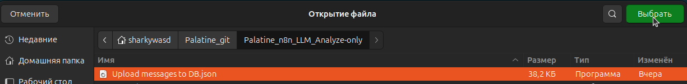

После импорта workflow создаём таблицу для сохранения сообщений в базе данных:
Находим `Сценарий для создания таблицы для сообщений в БД.` рядом с иснтрукцией, нажимаем на первую ноду PostgreSQL в сценарии.
В соответствующей ноде вводим данные, указанные для БД в .env файле. Порт по умолчанию 5432. Пример заполнения:

**3. Получаем API ключ OpenRouter**

https://openrouter.ai/

Регистрируемся, создаём API ключ, копируем.
Открываем workflow `LLM Analyze DB`. Находим ноду OpenRouter Chat Model в форме круга и создаём новый credentials, вставляем API ключ.

На бесплатном тарифе доступно до 20 запросов в минуту при 50 запросах в день максимум. Чтобы увеличить лимиты, нужно закинуть 10 долларов в "кредиты" на сайте OpenRouter, получите 1000 запросов в день максимум.

**4. Работаем с n8n**

4.1. Поочерёдно создаём новые workflow и импортируем все остальные workflow с помощью .json файлов: Channel_ID Parser, Chat_Opener_3_minutes, Chat_Opener_10_minutes, Error Сatcher, LLM UserInfo Sender. Если в новых workflow не появляются credentials, придётся заполнять руками по новой. Для указания ID админского чата можно использовать ноду Telepilot `Get Me` если используете личный аккаунт или триггер `On new message` в workflow `Upload messages to DB`

Описание сценариев и необходимые инструкции описаны в каждом workflow. Краткое описание:
1) Полезные и управляющие сценарии:
 - Session Control (Template by https://n8n.io/creators/ivancore/) - позволяет управлять сессией юзербота и получать уведомления о состоянии сессии. Через этот workflow логинимся в аккаунт с помощью Chat Trigger.
 - Error Catcher - напрвляет сообщения об ошибках выполения workflow в желаемый чат, если выбран в других workflow при возникновении ошибок.
 - Chat_Opener_10_minutes - позволяет получать обновления из групп/чатов с большим количеством обновлений, используется для чатов с нечастыми обновлениями.
 - Chat_Opener_3_minutes - позволяет получать обновления из групп/чатов с большим количеством обновлений, используется для чатов с частыми обновлениями.
2) Прикладные сценарии:
- Channel_ID Parser - позволяет получить метаданные о чате по предоставленной ссылке из листа Google Sheets.
- Cron MessageSender - позвляет отправлять запланированные сообщения в чаты
- Upload messages to DB - автоматическая загрузка входящих сообщений в базу данных при получении нового сообщения на аккаунте
- LLM Analyze DB - отправка данных из БД в LLM-сервис для анализа и сохранения результатов
- LLM UserInfo Sender - отправка данных о пользователях в желаемый чат
- DB Clean-up - удаление нерелевантных записей в базе данных по расписанию

4.2. Для включения автоматического исполнения workflow необходимо, чтобы все тригеры в workflow были включены. После чего публикуем сохранённую версию workflow.

Все последющие изменения должны быть сохранены и опубликованы для их применения при автоматическом выполнении сценариев.

В настройках workflow включаем сохранение прогресса выполнения (`Save execution progress`) и указываем запускаемый в случае ошибок workflow:

Производим данную операцию для всех необходимых workflow.

## Обновление образа n8n
https://docs.n8n.io/hosting/installation/docker/#updating

С помощью Docker Desktop: нажимаем `Pull` на образе n8n, останавливаем и поднимаем контейнер. Старый образ можно удалить после успешного обновления.

С помощью docker compose:
1) Переходим в директорию проекта
2) `docker compose pull`
3) `docker compose down`
4) `docker compose up -d`

## Особенности:
- Решена проблема Telepilot № 1: фикс ошибки скрипта установки ноды Telepilot без предустановленных библиотек вследствие ошибки определения ОС Alpine Linux с помощью которой устанавливается стандартный образ n8n (Self-hosted версия с установкой через Docker).
- Решена проблема Telepilot № 2: фикс ошибки отправки телеметрии (https://github.com/telepilotco/n8n-nodes-telepilot/issues/42)
- Telepilot до сих пор находится в разработке или разработка может быть даже заброшена. Последний релиз - 0.5.2 - май 2025 (Пункт написан 04.01.2026).
- https://github.com/telepilotco/n8n-nodes-telepilot/issues/43
- Может возникнуть проблема с работоспособностью ноды Telepilot при полном отключении сессии и очищении в чате с помощью команд `/stop`, `/clear`: `Chat not found` для чатов, которые на самом деле существуют. Для исправления проблемы вручную запускаем воркфлоу `Channel_ID_Parser` или испольуем ноды из Telepilot `Search public chat by username/title` (в случае группы/канала) или ноду-триггер `On new message` и отправляем на свой аккаунт сообщение с необходимого аккаунта (в случае личного чата).