# n8n-selftbot
Telegram userbot for analyzing user messages with LLM. Supports local PostgreSQL DB & automatic result messages sending to Telegram chat

### Структура проекта:
`./`:
- `docs` - скриншоты для README.md и промпты `prompts` для генерации новых данных в проекте
- `n8n-output` - промапленная директория в docker-compose для передачи файлов из системы в контейнер (загрузка тестовых данных через файлы). Внутри директории находится ещё одна директория `test_data`, содержащая текущие тестовые сообщения в шаблоне Google Sheets
- `src` - основные файлы проекта
- `README.md`

`./src`:
- `workflows` - импорты воркфлоу проекта в .json формате
- docker-compose.yml
- env_example.txt - пример .env файла
- Palatine_selfbot - шаблон гугл таблиц


### Порты для контейнера
- 5678 (по умолчанию) - n8n
- 5432 (по умолчанию) - PostgreSQL

## Setup and Build
*Все дальнейшие действия, связанные с установкой файлов из данного репозитория производятся пользователем на свой страх и риск. За несоблюдение пользовательского соглашения и правил использования Telegram предусмотрены различные ограничительные меры. Ответственность за их нарушение, а также ответственность за передачу учётных данных аккаунта вы несёте самостоятельно. Все риски и их возможные последствия установки и передачи данных сторонним сервисам несёте только вы.*

**Повторяйте нижеследующие щаги для последовательной установки и развёртывания проекта:**

**0. Регистрируем API Development Tools**

https://my.telegram.org/auth

1) Проходим авторизацию, вводим код. Попадаем на следующую страницу:

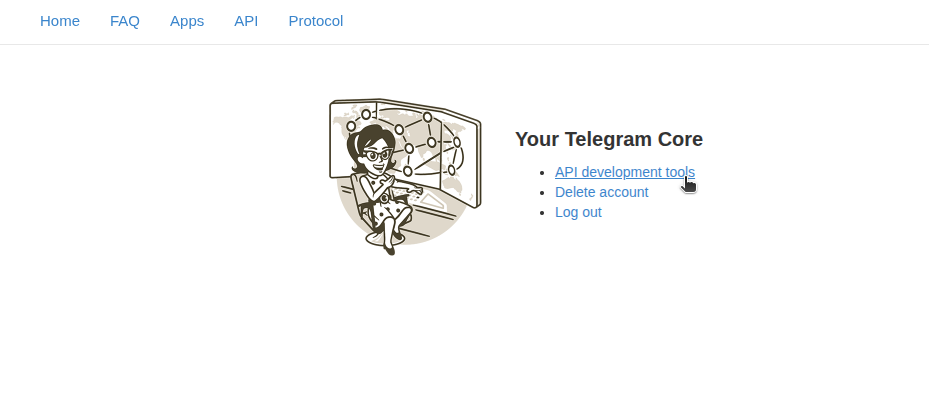

2) Нажимаем `API development tools`, попадаем в `Create new application`. Создаём новое приложение для получения API_ID и API_HASH
Заполняем все поля, вводим вразумительные названия, к примеру: 
- App Title: `Client Help Desk`
- App Shortname: `helpdesk1`
- URL: например, случайный сдаваемый в аренду (не занятый) домен, соответствующий региону регистрации аккаунта, я использовал `sviter.ru`
- Platform: Практичестки не имеет знаечния, я оставлял стандартный `Android`, можно попробовать `Web` или `Desktop`.
- Description: Имеющее смысл краткое описание на 10-15 слов. `Application for answering on client questions with of the automatic help desk`

3) Нажимаем `Create application`. На момент релиза рабочей версии (19.01.2026) Telegram до сих пор ведёт жестокий контроль за созданием данных приложений (получаем простое `ERROR` в ответ на нажатие кнопки), в  РФ осложнена регистрация новых аккаунтов. У меня получилось зарегистрировать приложение после насилия на кнопкой путём многократного нажатия кнопки и сброса ошибки с помощью клавиши `Enter` в течение 10 минут. Добро пожаловать в мир магии при регистрации приложения Telegram для получения api_id, api_hash, удачи!

**1. Клонируем репозиторий в желаемую директорию**
Создаём отдельную директорию для проекта. В директории будет склонирована папка `n8n-output` для взаимодействия с файлами через n8n. При желании название директории можно изменить, но важно изменить это название в .yml файле (упомянуто ниже).
Если нет опыта с Git, нажимаем `Download ZIP` и извлекаем содержимое архива в директорию проекта.

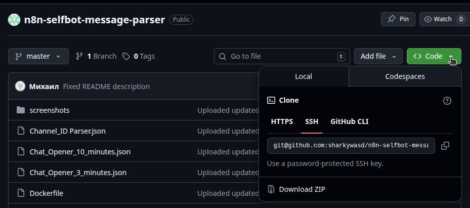

Или используйте предпочитаемый протокол:<br>
**HTTPS**:
```bash
git clone https://github.com/sharkywasd/n8n-selfbot-message-parser.git
```

**SSH** (только если настроен SSH-ключ)
```bash
git clone git@github.com:sharkywasd/n8n-selfbot-message-parser.git
```

**2. Запускаем контейнер**
В .yml файле описаны службы и образы, которые будут созданы и развёрнуты, в их список входят:
- заглушка для телеметрии Telepilot, которая мешает работе ноды (потому что баг Telepilot)
- БД postgresql
- n8n с предустановленной community-нодой Telepilot (@telepilotco/n8n-nodes-telepilot). В образе промаплена дополнительная папка `- ./n8n-output:/home/node/.n8n-files` в директории проекта, для чтения/записи файлов через n8n. При переименовании папки заменяем `n8n-output` в данной строке на название папки в директории проекта, которое вы ей задали.

Необходим установленный Docker и плагин Docker Compose:
https://docs.docker.com/compose/install/


1) **Настраиваем .env файл** (`./src/env_expample.txt`):
```bash
cd ./n8n-selfbot-message-parser/src
cp env_example.txt .env
nano .env
```
Достаточно изменить только пароль в Postgre `POSTGRES_PASSWORD`, но желательно также изменить `POSTGRES_USER`

- Параметры `N8N_LOG_LEVEL` и `N8N_LOG_OUTPUT` оставляем по умолчанию `info` и `console` (при необходимости изменяем: https://docs.n8n.io/hosting/logging-monitoring/logging/)


2) После настройки `.env` поднимаем контейнер:

```bash
docker compose -p "project-name" up -d
```
где:
- `-p` - флаг изменения названия проекта в докере (без фалага докер будет брать название папки, в которой лежит `docker-compose.yml`)
- `project-name` - задаваемое название проекта, которе будет префиксом для всех контейнеров, сетей и томов
- `up` - команда для запуска контейнеров
- `-d` - флаг, который позволяет открепить контейнер от терминала (то есть в терминале не будет видно логов, в терминале можно будет продолжать вводить новые команды, а если терминал закрыть, то контейнер продолжит работу)


**3. Логинимся в n8n**  
Через 30-60 секунд после скачивания и развёртывания образов n8n и postgresl переходим на адрес n8n:

http://localhost:5678

Проходим регистрацию на n8n, заполняем поля:
- Email (если захотите бесплатный триал платных функций - особеннос полезно создание папок с воркфлоу - на эту почту придёт письмо с кодом активации пробного периода )
- First Name
- Last Name
- Password - желательно сохранить в менеджере паролей


Пропускаем новое бесполезное окно нажатием кнопки `Get Started`:

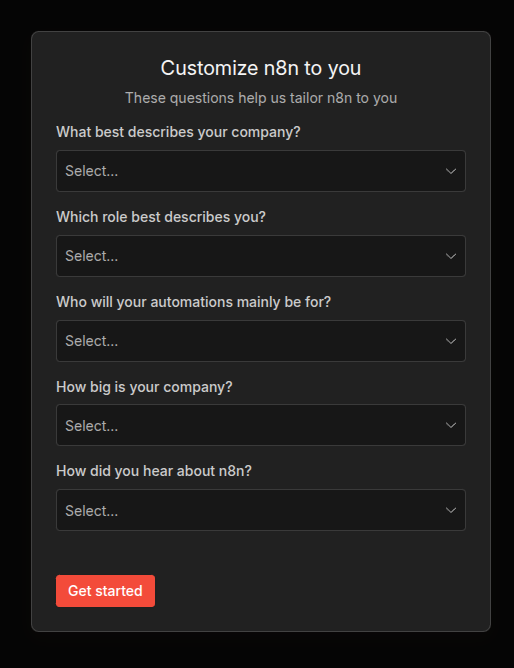

Пропускаем второе окно - `Skip`:

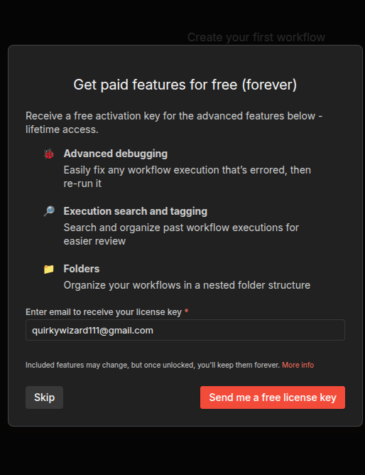

**4. Проверяем работоспособность ноды @sharkywasd/n8n-nodes-telepilot**

В левом нижнем углу экрана заходим в настройки `Settings` и находим меню `Community nodes`, нажимаем:

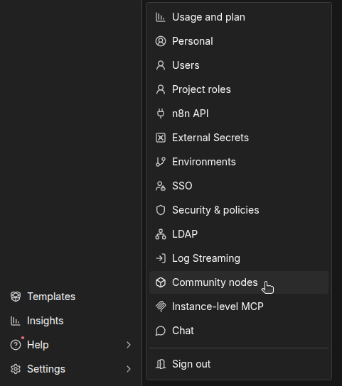

далее нажимаем на кнопку `Install a community node` и вводим в появившееся окно `@sharkywasd/n8n-nodes-telepilot`, не забыв прожать галочку, после чего жмём `Install`:

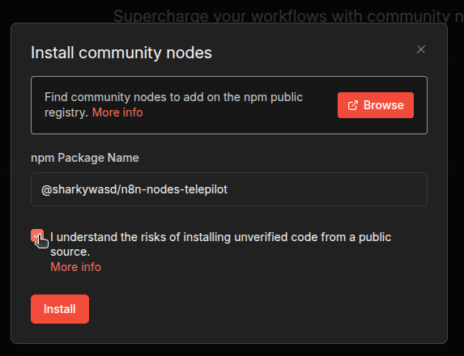

Ждём некоторое время, пока установится нода.

Переходим к проверке работоспособности коммюнити-ноды:

1) Создаём новый workflow:

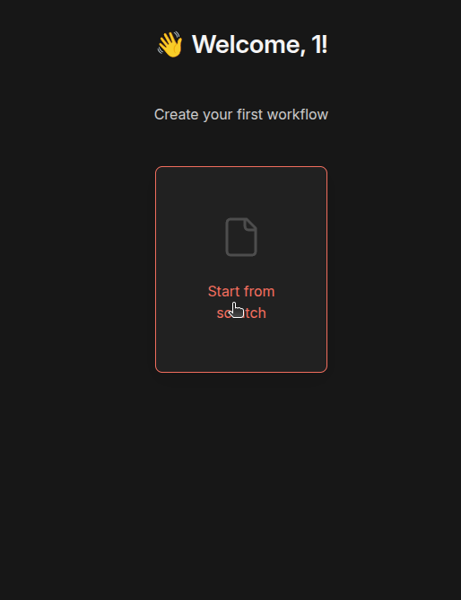

В правом вернем углу находим меню (три точки):

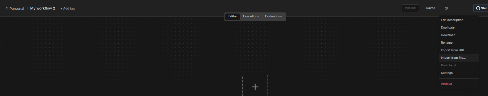

Импортируем файл `Session Control.json` из директории `./src/workflows/`:

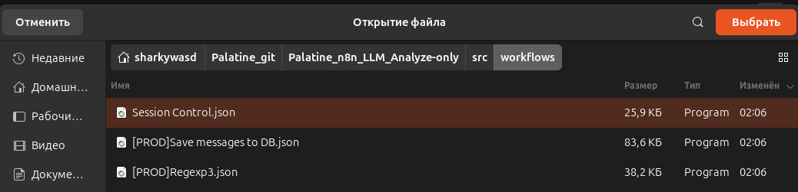

2) Заполняем credetials в ноде `Manual control` приссоединённой к ноде `When chat message receivede`:

Кликаем два раза
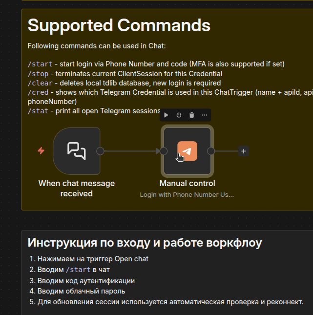

Создаём новые credentials
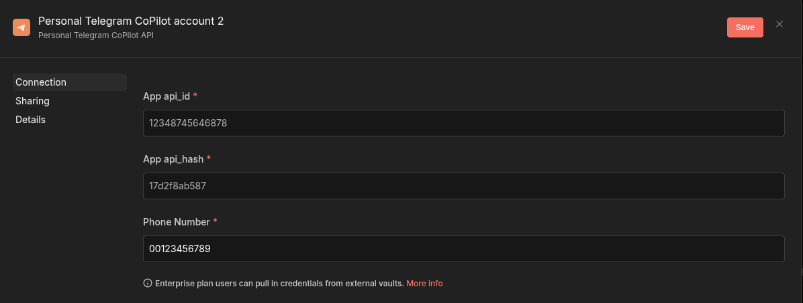

3) В workflow находим триггер `When chat message received` и нажимаем кнопку `Open chat`
.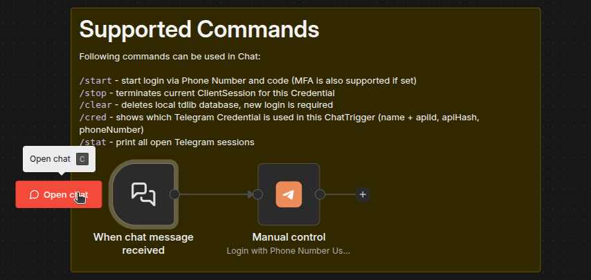

3) Пишем в чат-триггер ноду `/start`. При правильной работоспособности вы получите в течение 3-5 секунд сообщение от Telegram с кодом двухфакторной авторизации для входа в аккаунт (В данный момент вы передаёте данные для входа в свой аккаунт стороннему сервсиу, что может повлечь потерю аккаунта, выполнять только осознавая данный риск! по собственной воле, вся ответственность за ваш аккаунт и его безопасность лежит на вас!)

Если пришёл код, то значит билд установился правильно.

Вернёмся к импорту остальных workflow позже, а сейчас настроим все сервисы, необходимые для работы проекта.

## Подготавливаем сервисы, ноды, секреты.

**1. Подключение сервисов Google Cloud Console**

1) Вход в аккаунт. Создание нового проекта
https://console.cloud.google.com/projectcreate
2) Перходим в меню `APIs & services`, в поиске находим `Google Drive API` и включаем. Далее находим в поиске `Google Sheets API`, включаем.
3) Переходим в меню OAuth consent screen, жмём "Get Started". Заполняем название и свой e-mail в App Infomation. В Audience выбираем External. Снова свою почту в Contact Infomation, читаем :\) и принимаем соглашение, создаём. Дальше создаём OAuth client. Выбираем Web Application, название. Добавляем ссылку для редиректа из ноды Google Sheets в n8n в Authorized redirect URIs. **СОХРАНЯЕМ** Client ID и Client Secret.
4) Заходим в меню Audience, вводим свой e-mail в тестовых юзеров, сохраняем.
5) Создаём новый workflow, импортируем файл `LLM Batch1.json`. 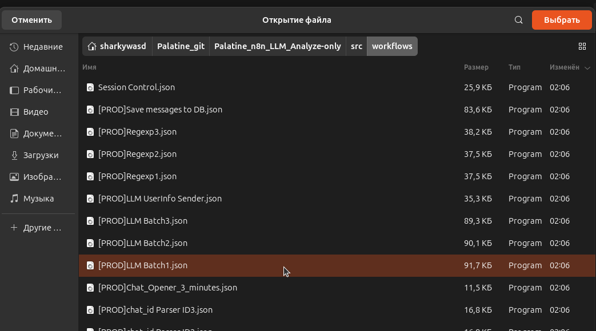 В ноде Google Sheets, например, в ноде `Get Test Data` добавляем новые учётные данные с предыдущих шагов (Client ID, Client Secret), сохраняем. Если видим зеленый цвет и сообщение об успешном тесте данных, то нажимаем `Sign in with Google` и входим с помощью почты тестового юзера. После предупреждения о проверке придоэения на следующем экране проставляем все три галочки-разрешения для корректной работы ноды. Если всё было сделано правильно, то получите сообщение об успешном подключении сервиса.

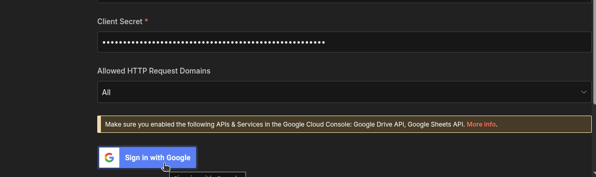

Осознаём предупреждение:

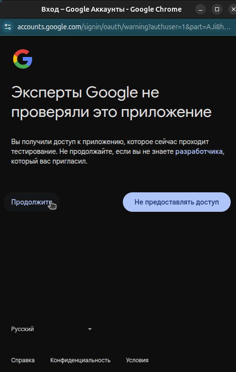

После данных шагов можно создать новую Гугл Таблицу на аккаунте (который был использован для регистрации в Google Cloud Console) и импортировать в неё предлагамую структуру листов и столбцов с помощью Excel файла `Palatine-selfbot-n8n.xlsx`.

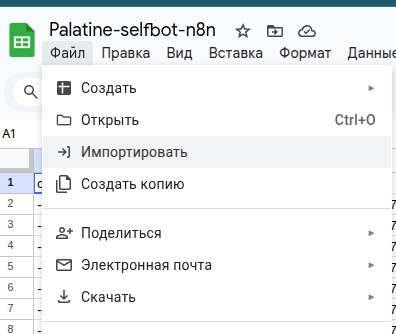
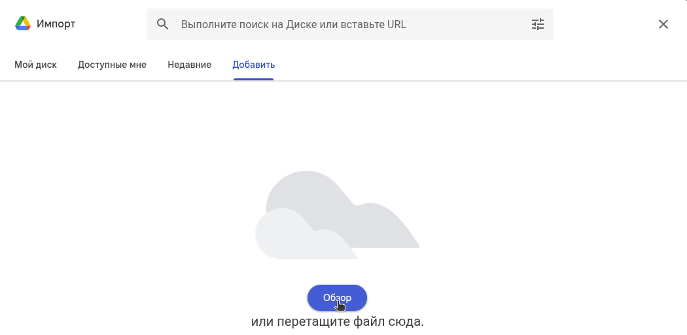
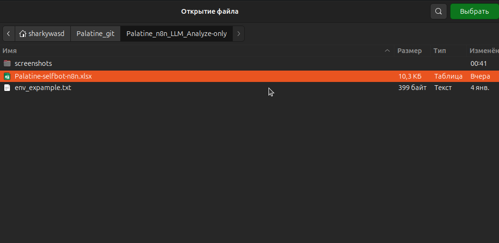

Предлагаемая структура листов:
1) `Search_data` - данные о сёрчах для промптов создания тестов и новых сёрчей.
2) `Real_Data_Validation` - лист для сохранения реальных сообщений, проанализированных с помощью RegExp и LLM. В столбце `human_valid` проставляется флаг для валидации данных (0 - false/nonrelevant; 1 - true/relevant)
3) `Search Speech` - лист первого сёрча (ID 1)
4) `Search Boards` - лист второго сёрча (ID 2)
5) `Search CV` - лист третьего сёрча (ID 3)
6) `Search Шаблон` - лист с шаблоном сёрча в Google Sheets

**2. Создаём учётную запись PostgreSQL в n8n**

Создаём новый workflow и импортируем файл `Save messages to DB.json`:


Импорт файла:
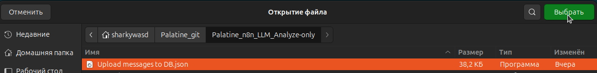

После импорта файла создаём таблицу для сохранения сообщений в базе данных:

- Находим `Сценарий для создания таблицы для сообщений в БД.` рядом с иснтрукцией, нажимаем на первую ноду PostgreSQL в сценарии.
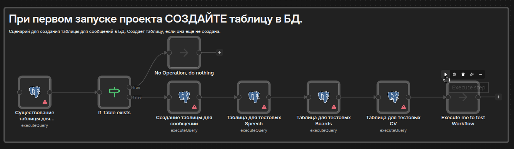

- В соответствующей ноде вводим данные, указанные для БД в .env файле. Порт по умолчанию 5432. Пример заполнения:

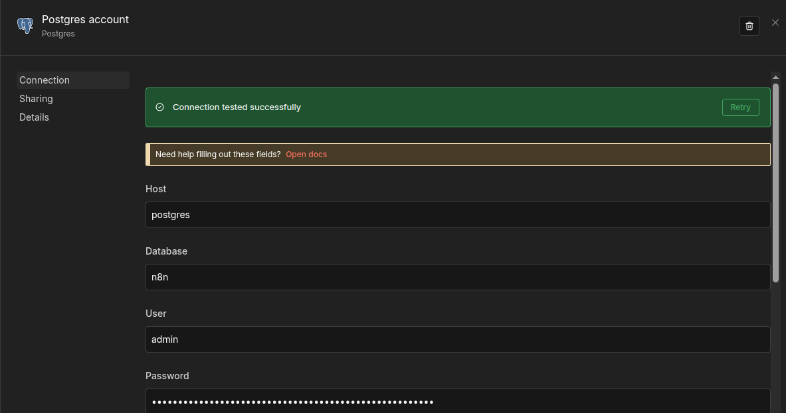

**3. Получаем API ключ OpenRouter**

https://openrouter.ai/

Регистрируемся, создаём API ключ, копируем.
Открываем workflow `LLM Batch1`. Находим ноду OpenRouter Chat Model в форме круга и создаём новый credentials, вставляем API ключ.

На бесплатном тарифе доступно до 20 запросов в минуту при 50 запросах в день максимум. Чтобы увеличить лимиты, нужно закинуть 10 долларов в "кредиты" на сайте OpenRouter, получите 1000 запросов в день максимум.

**4. Работаем с n8n**

4.1. Поочерёдно создаём новые workflow и импортируем все остальные workflow с помощью .json файлов.
<br>4.1.1. `LLM Batch2` и `LLM Batch2` - обработка сообщения с помощью LLM
<br>4.1.2. `Regexp1`, `Regexp2`, `Regexp3` - обработка сообщения регулряным вырадением
<br>4.1.3 `chat_id Parser ID1`, `chat_id Parser ID2`, `chat_id Parser ID3` - воркфлоу для записи chat_id в лист Search'а для фильтрации чатов в сёрчах
<br>4.1.4 `Error Сatcher` и `DB Clean-up` - отправка сообщений об ошибке в чат TG и очиска нерелевантных сообщений каждые 30 минут
<br>4.1.5 `UserInfo Sender` - отправка релевантных сообщений в чат TG
<br>4.1.6 `Chat_Opener_3_minutes` - открытие чатов для получения обновлений

Если в новых workflow появляются со значком предупреждения (красный треугольник), то надо выбрать добавленные credentials, а если их нет, то придётся заполнить их руками по новой, обновить страницу и они должны подтянуться в остальные ноды в воркфлоу.
Для указания ID админского чата можно использовать ноду Telepilot `Get Me` если используете личный аккаунт или триггер `On new message` в workflow `Upload messages to DB`

4.2. Для включения автоматического исполнения workflow необходимо, чтобы все тригеры в workflow были включены. После чего публикуем сохранённую версию workflow.

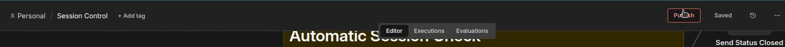

Все последющие изменения должны быть сохранены и опубликованы для их применения при автоматическом выполнении сценариев.

В настройках workflow включаем сохранение прогресса выполнения (`Save execution progress`) и указываем запускаемый в случае ошибок workflow:

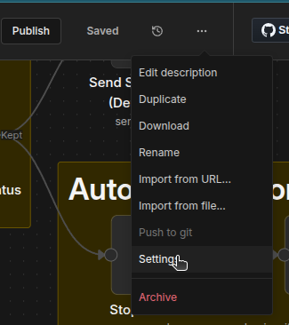
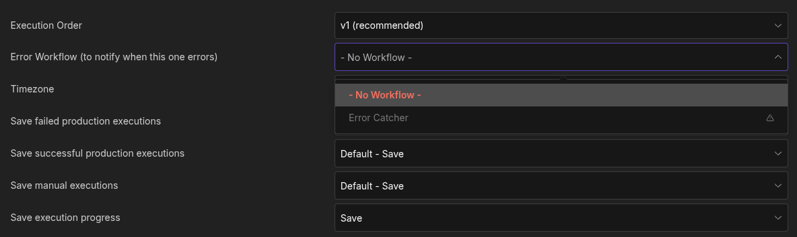

Производим операцию настройки (проведённую выше) для всех workflow.

4.3 Пример описания столбцов для одного search-листа (`Search Speech`):
- `A (ID)` - ID строки/записи.
- `B (Speech (ID 1))` - данные по сёрчу (название, ключевые слова, промпт, тестовые записи).
- `I (tg каналы в которых искать)` - список каналов/чатов для поиска (`@username`), заполняется каждый с новой строки без лишних символов.
- `J (tg каналы chat_id)` - список `chat_id` для каналов из столбца `I`.
- `K (куда отправляем релевантные сообщения)` - целевой `chat_id` для отправки релевантных сообщений.
- `N (Техническая инфа)` - служебный столбец (заполняется автоматически).

## Обновление образа n8n
https://docs.n8n.io/hosting/installation/docker/#updating

С помощью Docker Desktop: нажимаем `Pull` на образе n8n, останавливаем и поднимаем контейнер. Старый образ можно удалить после успешного обновления.

С помощью docker compose:
1) Переходим в директорию проекта
2) `docker compose pull`
3) `docker compose down`
4) `docker compose up -d`

## Особенности:
- Избегайте слишком часты запросов к Telegram для избежания блокировки аккаунта.
- Может возникнуть проблема с работоспособностью ноды Telepilot при полном отключении сессии и очищении в чате с помощью команд `/stop`, `/clear`: `Chat not found` для чатов, которые на самом деле существуют. Для исправления проблемы вручную запускаем воркфлоу `chat_id Parser ID1` или испольуем ноды из Telepilot `Search public chat by username/title` (в случае конкретного группы/канала) или ноду-триггер `On new message` и отправляем на свой аккаунт сообщение с необходимого аккаунта (в случае личного чата). После полноценного выполнения воркфлоу ошибка должна исчезунть.
